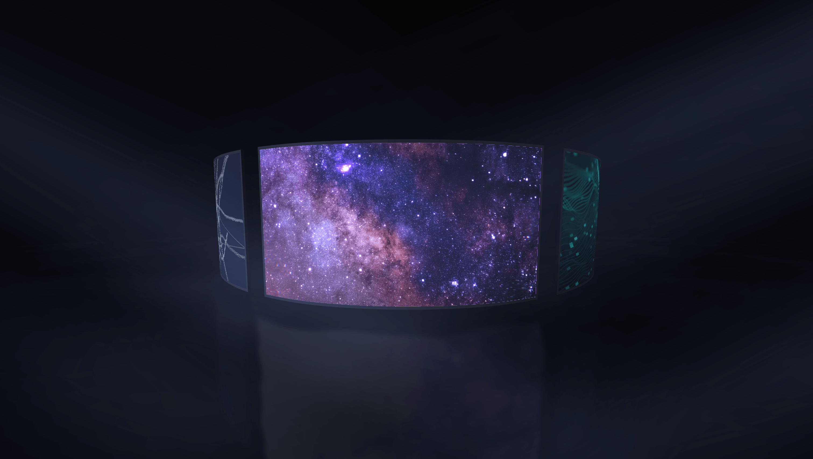

# ArcLight Cylinder

A cylindrical gallery built with Three.js, 🤖 Generated with Claude Code Opus 4.7 

- <a href="https://hisamikurita.github.io/arclight-cylinder/">DEMO</a>



## Usage

* Clone repository
* Install Node.js
* Run following commands
```
  pnpm install
  pnpm dev
```

* Before deploying, run command for production.
```
  pnpm build 
```